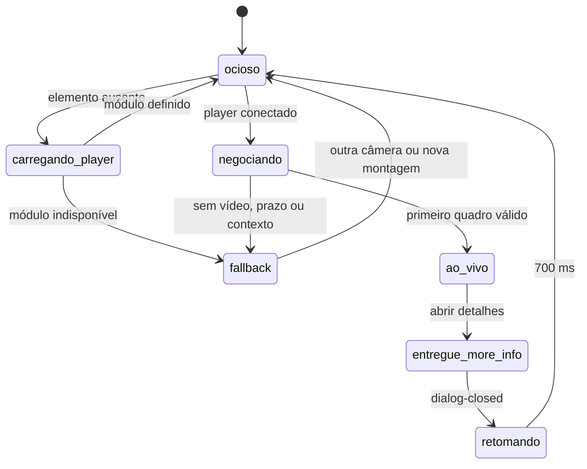

# 25 — Streaming de câmeras: WebRTC, More Info e quadros verdes

Data: 2026-08-10
Escopo: subviews dos cômodos, subview Segurança/Câmeras e card dinâmico de câmeras da Home.

## Resultado executivo

A infraestrutura ONVIF/WebRTC foi mantida. O tablet já havia provado que o
`ha-web-rtc-player` entrega vídeo em tempo real nas 16 entidades que anunciam
WebRTC. O defeito estava no frontend Bruno:

1. o código consultava `customElements.get('ha-web-rtc-player')` uma vez e
   desistia silenciosamente quando o Home Assistant ainda não tinha carregado o
   módulo;
2. abrir More Info destruía a sessão da tile e gravava uma suspensão permanente
   naquela instância;
3. qualquer `Image.onload` era aceito, inclusive uma imagem decodificável cujo
   conteúdo era um grande bloco verde uniforme.

A correção mantém WebRTC direto, sem reabrir HLS como fallback. Instantâneos
continuam visíveis durante a negociação e somente uma câmera principal fica ao
vivo por superfície.

## Evidência que levou ao diagnóstico

### PC

No diagnóstico do build `bruno-dashboard.tdYjE8QO.js` não havia nenhum marcador
de tentativa ou primeiro quadro do player. Havia somente requisições de
instantâneos do Office. Isso é compatível com uma carga fria em que o custom
element ainda não foi registrado.

### Tablet

Na sessão persistente do WebView apareceram primeiros quadros WebRTC entre
aproximadamente 2,8 e 4,1 segundos. Ao abrir e fechar More Info, a tile passava a
instantâneos até sair e entrar novamente na subview. Esse comportamento era
literalmente programado pelo antigo `_liveSuspendedEntities` / `_aoVivoSuspenso`.

### Tela verde

As imagens verdes disparavam `load`, portanto não eram erro HTTP nem placeholder
CSS. A captura mostrava uma faixa válida e uma região verde quase uniforme. O
motor promovia esse quadro porque validava transporte e decodificação, não o
conteúdo visual.

## Arquitetura aplicada

### Carregamento determinístico

O serviço `services/camera/ha-webrtc-player.ts` concentra o caminho compartilhado:

1. usa imediatamente `ha-web-rtc-player` quando já está definido;
2. numa carga fria, chama `window.loadCardHelpers()`;
3. usa `createCardElement({ type: 'picture-entity', camera_view: 'live' })` apenas
   para acionar o lazy-load oficial do módulo de câmera;
4. a sonda nunca é conectada ao DOM e não abre outro stream;
5. aguarda `customElements.whenDefined('ha-web-rtc-player')` por até 6 segundos;
6. só então o consumidor cria e conecta o player direto.

Chamadas simultâneas compartilham a mesma Promise de definição. A foto permanece
na tela se o carregamento não estiver disponível.

### Estado do vídeo por superfície

O evento oficial `dialog-closed`, filtrado para `ha-more-info-dialog`, substitui
a antiga suspensão permanente. O atraso de 700 ms evita que o modal e a tile
disputem a mesma câmera durante a desmontagem da sessão anterior.

### Ordem obrigatória da negociação

Continua valendo a correção anterior:

1. criar o player;
2. conectar ao slot que recebe os contextos internos do Home Assistant;
3. aguardar o primeiro `updateComplete`;
4. atribuir `entityid`;
5. aguardar primeiro quadro real com `video.readyState >= 2`;
6. somente então esconder o instantâneo e retirar a câmera do motor de snapshots.

## Quarentena de quadro verde

O motor desenha uma amostra de 48 × 27 pixels num canvas. O quadro é rejeitado
quando ao menos 45% dos pixels opacos caem no mesmo cubo RGB de 16 níveis e esse
cubo é fortemente verde. A concentração por cor diferencia o bloco corrompido
de folhagem real, que varia entre muitos tons.

Quando rejeitado:

- o último quadro bom permanece na tela;
- o desfecho é `quadro-verde` e conta como falha do ciclo;
- o recuo normal do motor protege câmera e VM;
- o diagnóstico registra a ocorrência;
- no vídeo WebRTC, o player continua oculto e uma nova amostra é feita 700 ms
  depois, dentro do prazo geral de 30 segundos.

Se o canvas estiver indisponível ou protegido, a validação falha aberta: a
câmera continua funcionando. Isso evita que uma limitação do navegador seja
tratada como falha de imagem.

## Política de carga preservada

- Subview de cômodo: somente a câmera do palco fica ao vivo; PIP é snapshot.
- Segurança: somente a câmera principal selecionada fica ao vivo; as sete
  secundárias são snapshots.
- Home: somente a câmera ativa do card fica ao vivo.
- A câmera só sai do motor de instantâneos depois do primeiro quadro WebRTC
  válido.
- Não foram ativados `preload stream`, HLS, go2rtc adicional nem oito streams
  simultâneos.

## Telemetria adicionada

O painel pode exibir, por entidade:

- `player webrtc · ausente; carregando modulo`;
- `player webrtc · definido sob demanda`;
- `player webrtc · definicao indisponivel`;
- `player webrtc · entityid atribuido`;
- `player webrtc · primeiro quadro`;
- `player webrtc · quadro verde rejeitado`;
- `player webrtc · entregue ao more-info`;
- `player webrtc · more-info fechado; retomando`;
- `snapshot verde rejeitado`;
- no motor, `ultimoDesfecho: quadro-verde`.

Esses marcadores permitem separar player ausente, negociação lenta, sessão sem
vídeo, handoff do modal e corrupção visual.

## Arquivos funcionais

| Arquivo | Papel |
|---|---|
| `dashboard-src/src/services/camera/ha-webrtc-player.ts` | lazy-load, criação, marcadores e detecção verde compartilhados |
| `dashboard-src/src/services/camera/snapshot-engine.ts` | quarentena antes de promover instantâneo |
| `dashboard-src/src/components/rooms/bruno-room-subview.ts` | estado e retomada nas subviews dos cômodos |
| `config/www/bruno-ui/subviews/bruno-cameras-security-subview.js` | estado e retomada na Segurança |
| `config/www/bruno-ui/cards/bruno-home-camera-card.js` | estado e retomada no card da Home |
| `dashboard-src/src/main.ts` | ponte temporária `globalThis.BrunoCameraLive` para os dois módulos clássicos |
| `config/configuration.yaml` | bundle `BY5H2fqa` e cache-bust dos módulos clássicos |

## Validação automatizada

- TypeScript: sem erros.
- ESLint: sem erros.
- Sintaxe dos dois módulos clássicos: válida por `node --check`.
- Testes novos da imagem verde: bloco uniforme rejeitado; cena normal e
  folhagem variada aceitas.
- Motor: quadro verde não chama `aoCarregar`, permanece sem quadro promovido e
  contabiliza falha.
- Testes direcionados desta rodada: 46 aprovados.
- Gate completo do bundle: 12 arquivos de teste e 208 testes aprovados.

O aceite funcional continua dependendo do runtime real do Home Assistant e do
tablet.

## Publicação na VM

Publicada em `\\192.168.3.102\config`:

- bundle `bruno-dashboard.BY5H2fqa.js` e sourcemap;
- `manifest.json` e `bruno-loader.js`;
- `bruno-home-camera-card.js`;
- `bruno-cameras-security-subview.js`;
- `configuration.yaml` com os três recursos novos.

Sete pares local × VM foram conferidos por SHA-256 e são idênticos. Os bundles
antigos da VM não foram apagados. Antes da cópia foi criado o rollback:

`\\192.168.3.102\config\tmp\rollback-20260810-webrtc-lifecycle-BY5H2fqa`

**Estado operacional:** arquivos publicados; reinício do Home Assistant
pendente. A interface web disponível nesta execução não tinha sessão autenticada,
portanto o reinício não foi disparado automaticamente. Até ele ocorrer, o
processo atual do HA continua servindo a lista anterior de módulos.

## Roteiro de aceite no runtime

1. Reiniciar o Home Assistant, porque mudou `frontend.extra_module_url`.
2. Recarregar completamente PC e Fully Kiosk.
3. Confirmar no diagnóstico o novo nome de bundle.
4. No PC frio, entrar primeiro numa subview de cômodo sem abrir More Info:
   deve aparecer `ausente; carregando modulo`, depois `definido sob demanda`,
   `entityid atribuido` e `primeiro quadro`.
5. No tablet, abrir uma subview de cômodo, aguardar vídeo, abrir More Info,
   fechar e confirmar que a tile retoma sem sair da subview.
6. Repetir na Home e na Segurança.
7. Na Segurança, confirmar que só a principal é vídeo; secundárias continuam
   snapshots por projeto.
8. Observar por pelo menos cinco minutos se quadro verde é preservado pelo
   último quadro bom e aparece na telemetria como rejeitado.

## Limites conhecidos

- O primeiro quadro ainda exige uma nova negociação WebRTC; a pausa inicial não
  pode ser eliminada sem compartilhar uma conexão com o More Info, contrato que
  o frontend do HA não oferece.
- `ha-web-rtc-player` continua sendo elemento interno. O carregamento passou a
  ser pedido pela API suportada dos helpers, reduzindo a fragilidade, mas uma
  atualização grande do Home Assistant ainda exige regressão.
- O detector verde é propositalmente conservador. Corrupções não uniformes
  podem passar; uma cena artificial quase toda no mesmo verde pode ser rejeitada.
- Se o verde continuar no WebRTC depois de repetidas amostras, investigar
  codec/keyframe/encoder e logs do pipeline ONVIF/FFmpeg; o frontend não corrige
  um stream de origem permanentemente corrompido.

## Reavaliação dos quadros verdes — 2026-08-14

A nova rodada confirmou que o caminho ativo já é o player WebRTC nativo do Home
Assistant (`ha-web-rtc-player`). O watchdog compartilhado amostra o canvas,
rejeita quadro uniformemente verde e blocos verdes parciais, preserva o último
quadro bom e mantém snapshot enquanto o vídeo não se recupera.

O fato de o elemento concluir `load`/decodificação e ainda produzir verde torna
improvável uma causa de CSS, URL ou “loading data”. A hipótese tecnicamente mais
compatível continua sendo corrupção transitória de quadro decodificado, ligada
a keyframe/codec/encoder ou à sessão ONVIF. O frontend consegue colocar o quadro
em quarentena, mas não reparar conteúdo já corrompido na origem.

Decisão desta rodada:

- não trocar o player nativo;
- não acrescentar uma segunda camada go2rtc/HLS sem evidência de origem;
- não abrir streams simultâneos adicionais;
- preservar a política de uma câmera ao vivo e PIP por snapshot;
- manter o detector atual, pois ele é conservador e falha aberto;
- não publicar nova alteração de câmera nesta rodada.

Próximo diagnóstico, somente se a recorrência justificar: correlacionar horário
do quadro verde com logs ONVIF/FFmpeg/go2rtc do host, codec negociado e chegada
de keyframes. Isso exige evidência do runtime do Everex e não deve ser inferido
apenas pelo JavaScript do dashboard.

## Rollback

1. Em `configuration.yaml`, reativar:
   - `bruno-dashboard.tdYjE8QO.js`;
   - `bruno-cameras-security-subview.js?v=20260810-webrtc-lit-context-1`;
   - `bruno-home-camera-card.js?v=20260810-webrtc-lit-context-1`.
2. Reiniciar o Home Assistant.
3. O código anterior permanece no Git e os pontos substituídos estão marcados
   `ANTERIOR (rollback 2026-08-10)` nos arquivos.

## Segurança/Câmeras no telefone — privacidade e quarentena contínua (2026-08-25)

### Escopo

Esta rodada é exclusiva do ramo mobile da subview Segurança/Câmeras, selecionado
por `_isMobileLayout()` em até 800 px. O markup, a grade e as dimensões aprovadas
não foram alterados. O tablet continua executando o caminho anterior.

### Privacidade

A superfície de estado e a sincronização in-place já existiam, mas as regras que
escureciam a mídia e centralizavam a mensagem estavam dentro de
`@media (min-width: 801px)`. Por isso o telefone atualizava a entidade e congelava
a imagem, porém não pintava o estado visual.

Foi adicionada a mesma semântica no bloco `@media (max-width: 800px)`, escopada
por `.security-subview.is-mobile-v2`:

- a imagem e o `hui-image` ficam ocultos quando o host recebe `is-private`;
- uma superfície escura mostra `Modo privacidade ativo` no centro;
- o cabeçalho e o menu permanecem acima da superfície, permitindo desligar a
  privacidade sem desmontar o player;
- o estado continua sendo sincronizado sem `_render()`, portanto abrir o menu ou
  alternar a chave não reinicia a sessão ao vivo.

### Quadros verdes

O detector compartilhado de 48 × 27 pixels e o motor de snapshots já rejeitavam
os quadros verdes periódicos. Permaneciam três lacunas na subview nova:

1. a imagem inicial criada pelo markup era revelada apenas pelo evento `load`;
2. a troca principal ↔ miniatura atribuía o URL diretamente;
3. o `hui-image` era verificado somente no primeiro quadro e podia corromper
   depois, ou ser promovido automaticamente ao fim do prazo.

No telefone, a subview agora:

- mantém imagens iniciais ocultas até a amostragem confirmar um quadro válido;
- pré-valida a imagem candidata de uma troca antes de substituir o último quadro
  bom;
- observa a mídia real aninhada no shadow DOM do `hui-image` a cada 500 ms;
- ao detectar verde total ou parcial, remove somente `is-ready`, revelando o
  snapshot validado que já está por baixo;
- mantém o mesmo player conectado e o promove novamente quando os pixels voltam
  ao normal;
- pede um snapshot seguro apenas na entrada da quarentena, evitando carga a cada
  ciclo de observação;
- falha aberto quando o navegador não permite amostragem por canvas.

Não foram modificadas entidades, URLs, codec, ONVIF, go2rtc, quantidade de
streams nem política de uma câmera principal ao vivo.

### Build e validação

- `node --check`: aprovado no módulo clássico;
- detector de crase no arquivo alterado: aprovado;
- TypeScript e ESLint: aprovados;
- Vitest: 277 de 277 testes aprovados;
- YAML: 250 arquivos aprovados;
- grafo local de chunks: 7 módulos alcançáveis, nenhum ausente;
- bundle gerado: `bruno-dashboard.B_IHs_CU.js`;
- chunk da subview de câmeras: `bruno-cameras-security-subview.DlFTO3Vm.js`.

O aceite definitivo da quarentena contínua depende do iPhone, porque o banco de
desktop não reproduz o pipeline ONVIF/WebRTC nem a composição do WebView/Safari.

### Rollback desta rodada

Backup local antes da edição e do build:

`tmp/everex-preflight-20260825-cameras-privacy-green/local`

Para voltar somente esta rodada, restaurar o módulo clássico e a pasta
`www/dashboard` desse backup, reativar
`bruno-dashboard.DZ0RebDD.js` em `configuration.yaml` e reiniciar o Home
Assistant.
